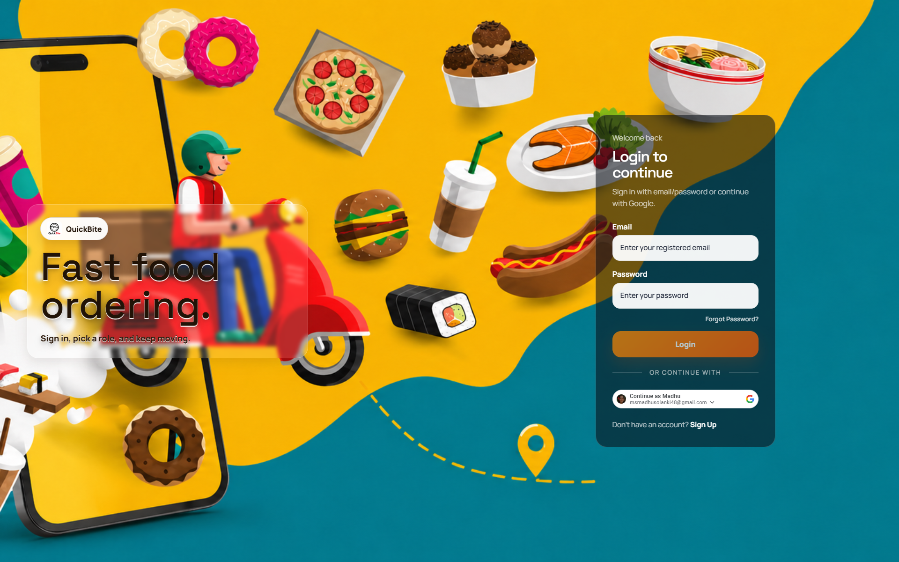
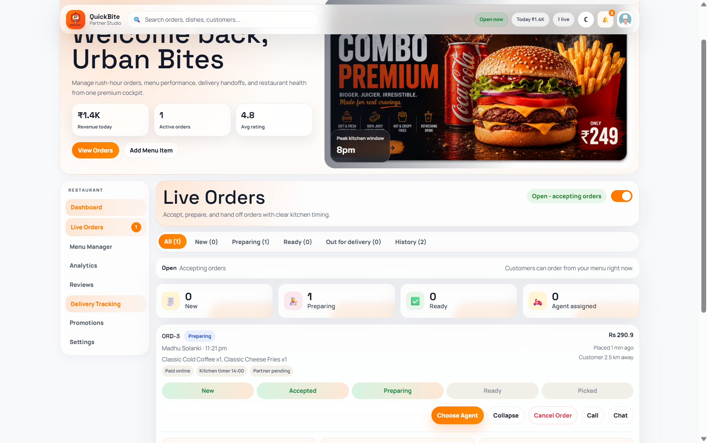
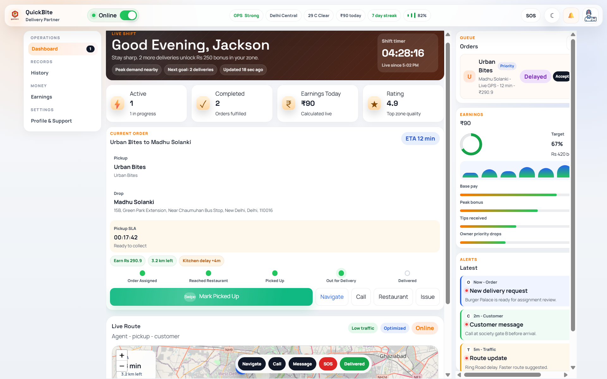
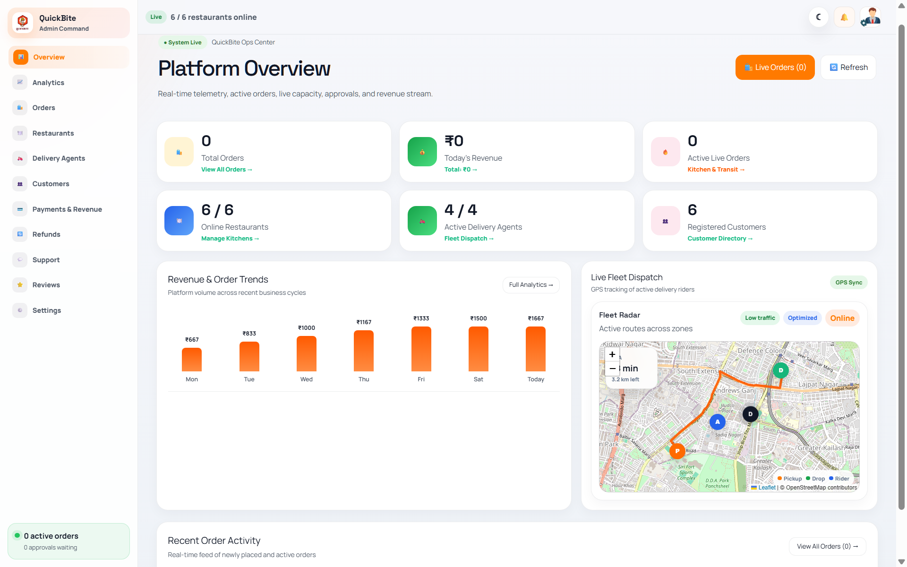
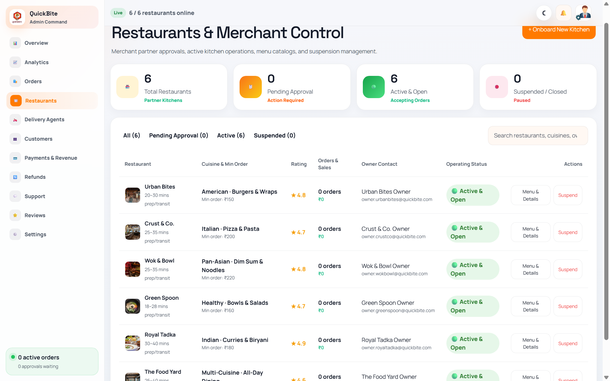

# QuickBite — Backend (Spring Boot Microservices)

> **Final-Year Project / Academic Capstone**  
> A distributed, event-driven microservices backend for food ordering, kitchen management, and delivery tracking. Built with **Spring Boot 3**, **Spring Cloud (Eureka + Gateway)**, **MySQL**, **RabbitMQ**, **Redis**, and **Docker Compose**.

---

## 📸 Platform Highlights

### 🔐 1. Multi-Role Authentication & Access Control
<p align="center">
  
</p>

### 🍔 2. Platform Cockpits & Operations

| Restaurant Owner Live Cockpit | Delivery Partner Real-Time Portal |
|:---:|:---:|
|  |  |

| Admin Management & Analytics | Multi-Restaurant Catalog |
|:---:|:---:|
|  |  |

---

## 📑 Table of Contents

- [About the Backend](#-about-the-backend)
- [System Architecture](#-system-architecture)
- [Tech Stack](#-tech-stack)
- [Microservices Catalog](#-microservices-catalog)
- [Database Schema & Structure](#-database-schema--structure)
- [Login Credentials & Demo Accounts](#-login-credentials--demo-accounts)
- [How to Run the Backend](#-how-to-run-the-backend)
  - [Option A: Running Locally with Docker Compose](#option-a-running-locally-with-docker-compose)
  - [Option B: Exposing Local Backend to Live Vercel App (ngrok)](#option-b-exposing-local-backend-to-live-vercel-app-ngrok)
- [API Reference & Swagger Endpoints](#-api-reference--swagger-endpoints)

---

## 💡 About the Backend

The QuickBite backend implements a production-style microservices architecture adhering to the **Database-per-Service** design pattern. Seven specialized Spring Boot services handle domain logic independently and communicate asynchronously via **RabbitMQ** and synchronously through a **Spring Cloud API Gateway**.

Key engineering highlights:
- **Service Discovery**: Microservices dynamically register with Netflix Eureka (`:8761`).
- **Reactive API Gateway**: Handles centralized authentication, routing, WebSocket protocol tunneling (`ws://`), and response header CORS deduplication.
- **Asynchronous Mailer**: Order confirmation emails are dispatched using `CompletableFuture.runAsync()`, preventing remote SMTP connection delays from blocking HTTP order placement threads.
- **Real-Time Notification Pipeline**: Order events published to RabbitMQ are dispatched to client dashboards via STOMP WebSockets.

---

## 🏛 System Architecture

```
                           ┌──────────────────────────────┐
                           │   Angular 21 Web Client      │
                           │  (Vercel or localhost:4200)  │
                           └──────────────┬───────────────┘
                                          │ HTTP / ws://
                           ┌──────────────▼───────────────┐
                           │      API Gateway (:8080)     │
                           │   Spring Cloud / Reactive    │
                           │ (CORS Dedupe / JWT / Routing)│
                           └──────────────┬───────────────┘
                                          │
    ┌──────────────────┬──────────────────┼──────────────────┬──────────────────┐
    │                  │                  │                  │                  │
┌───▼───────────┐ ┌────▼──────────┐ ┌─────▼──────────┐ ┌─────▼──────────┐ ┌─────▼──────────┐
│  Auth Service │ │ Restaurant Svc│ │  Order Service │ │ Delivery Svc   │ │ Payment Service│
│     :8081     │ │     :8082     │ │     :8083      │ │     :8085      │ │     :8084      │
│  quickbite_   │ │  quickbite_   │ │  quickbite_    │ │  quickbite_    │ │  quickbite_    │
│      auth     │ │   restaurant  │ │     order      │ │    delivery    │ │    payment     │
└───────────────┘ └───────────────┘ └────────┬───────┘ └────────┬───────┘ └────────────────┘
                                             │                  │
                                             └────────┬─────────┘
                                                      │ AMQP
                                            ┌─────────▼────────┐
                                            │ RabbitMQ Broker  │
                                            │   :5672 / :15672 │
                                            └──────────────────┘
                                                      ▲
                                                      │ Service Discovery
                                            ┌─────────┴────────┐
                                            │  Eureka Server   │
                                            │      :8761       │
                                            └──────────────────┘
```

---

## 🛠 Tech Stack

| Layer | Technologies |
|---|---|
| **Language & Runtime** | Java 21 LTS |
| **Backend Framework** | Spring Boot 3.4.x, Spring Framework 6.x |
| **API Gateway** | Spring Cloud Gateway (Reactive Netty) |
| **Service Registry** | Spring Cloud Netflix Eureka |
| **ORM & Persistence** | Spring Data JPA, Hibernate ORM, MySQL 8 |
| **Message Broker** | RabbitMQ (Topic & Direct Exchanges) |
| **Real-Time WebSockets** | Spring WebSocket, STOMP protocol |
| **In-Memory Cache** | Redis 7 (Alpine) |
| **Security & Auth** | Spring Security 6, Stateless JWT (HMAC-SHA256), Google OAuth 2.0 |
| **Payment Gateway** | Razorpay Java SDK |
| **Email Service** | JavaMail, Gmail SMTP (Asynchronous Non-Blocking) |
| **Containerization** | Docker, Docker Compose |
| **API Docs** | SpringDoc OpenAPI 3, Swagger UI |
| **Build Tool** | Apache Maven 3.9+ |

---

## 📦 Microservices Catalog

| Service | Port | Database | Responsibilities |
|---|:---:|:---:|---|
| **`eureka-server`** | `8761` | *N/A* | Centralized service registry. |
| **`api-gateway`** | `8080` | *N/A* | Gateway routing, JWT validation, CORS deduplication, WebSocket tunneling. |
| **`auth-service`** | `8081` | `quickbite_auth` | User authentication, JWT issuance, email OTPs, Google OAuth. |
| **`restaurant-service`** | `8082` | `quickbite_restaurant` | Restaurant profiles, dynamic menus, categories, operating hours. |
| **`order-service`** | `8083` | `quickbite_order` | Order placement, status transitions, non-blocking email dispatch. |
| **`payment-service`** | `8084` | `quickbite_payment` | Razorpay order creation and webhook signature validation. |
| **`delivery-service`** | `8085` | `quickbite_delivery` | Rider assignment, delivery statuses, distance and earnings calculation. |
| **`review-service`** | `8086` | `quickbite_review` | Dish reviews, star ratings, and feedback moderation. |
| **`cart-service`** | `8088` | `quickbite_cart` | Server-side cart persistence per customer. |

---

## 🗄 Database Schema & Structure

QuickBite runs with **7 isolated MySQL databases**:

```sql
CREATE DATABASE IF NOT EXISTS quickbite_auth;
CREATE DATABASE IF NOT EXISTS quickbite_restaurant;
CREATE DATABASE IF NOT EXISTS quickbite_order;
CREATE DATABASE IF NOT EXISTS quickbite_payment;
CREATE DATABASE IF NOT EXISTS quickbite_delivery;
CREATE DATABASE IF NOT EXISTS quickbite_review;
CREATE DATABASE IF NOT EXISTS quickbite_cart;
```

---

## 🔑 Login Credentials & Demo Accounts

All demo accounts are pre-seeded in the database:

### 👑 Super Admin
- **Email**: `admin@quickbite.dev` (or `admin@quickbite.com`)
- **Password**: `Admin@1234` (or `QuickBite@123`)

### 👨‍🍳 Restaurant Owners
- **Password for ALL Owners**: `QuickBite@123`

| Restaurant Name | Email | Associated ID |
|---|---|:---:|
| **Urban Bites** | `owner.urbanbites@quickbite.com` | `1` / `urban-bites` |
| **Crust & Co.** | `owner.crustco@quickbite.com` | `2` / `crust-and-co` |
| **Royal Tadka** | `owner.royaltadka@quickbite.com` | `3` / `royal-tadka` |
| **Wok & Bowl** | `owner.wokbowl@quickbite.com` | `4` / `wok-and-bowl` |
| **Green Spoon** | `owner.greenspoon@quickbite.com` | `5` / `green-spoon` |
| **The Food Yard** | `owner.foodyard@quickbite.com` | `6` / `the-food-yard` |

### 🛵 Delivery Agents
- **Password for ALL Agents**: `QuickBite@123`

| Agent Name | Email | Phone Number | Vehicle & Zone |
|---|---|---|---|
| **Jackson Ron** | `agent1@quickbite.com` | `+91 98765 00001` | Bike &bull; West Delhi |
| **Paul Weasely** | `agent2@quickbite.com` | `+91 98765 00002` | Scooter &bull; North Delhi |
| **Olive Mandy** | `agent3@quickbite.com` | `+91 98765 00003` | Electric Bike &bull; East Delhi |
| **Edward Ford** | `agent4@quickbite.com` | `+91 98765 00004` | Bike &bull; South Delhi |

### 👤 Customer
- **Email**: `customer@quickbite.com`
- **Password**: `QuickBite@123`

---

## 🚀 How to Run the Backend

### Prerequisites
- **Java 21 LTS** & **Maven 3.9+**
- **Docker & Docker Compose**
- **MySQL 8.0+** running on `localhost:3306`

---

### Option A: Running Locally with Docker Compose

1. **Clone the repository:**
   ```bash
   git clone https://github.com/Madhusolanki48/QuickBite.git
   cd QuickBite
   ```

2. **Configure your `.env` file:**
   ```bash
   cp .env.example .env
   ```

3. **Start all services:**
   ```bash
   docker-compose up -d
   ```
   All microservices will register with Eureka (`http://localhost:8761`) and listen via the API Gateway at `http://localhost:8080`.

---

### Option B: Exposing Local Backend to Live Vercel App (ngrok)

> **Student Demo Setup**:  
> Since the backend runs locally on your machine in Docker and the frontend is hosted on **Vercel**, we use **ngrok** to bridge the live Vercel web app to your local API Gateway (`port 8080`).

1. **Start the local Docker containers:**
   ```powershell
   docker-compose up -d
   ```

2. **Start the ngrok tunnel:**
   ```powershell
   .\ngrok.exe http --url=booth-salad-specimen.ngrok-free.dev 8080
   ```

3. **Open the live Vercel app:**
   👉 **[quickbite-frontend.vercel.app](https://quickbite-frontend.vercel.app)**

> The deployed Vercel frontend automatically connects to `https://booth-salad-specimen.ngrok-free.dev/api` for API requests and STOMP WebSockets.

---

## 📖 API Reference & Swagger Endpoints

With the backend running, explore the interactive Swagger documentation:

- **API Gateway (Central Proxy)**: `http://localhost:8080`
- **Eureka Service Registry**: `http://localhost:8761`
- **Auth Service**: `http://localhost:8081/swagger-ui.html`
- **Restaurant Service**: `http://localhost:8082/swagger-ui.html`
- **Order Service**: `http://localhost:8083/swagger-ui.html`
- **Payment Service**: `http://localhost:8084/swagger-ui.html`
- **Delivery Service**: `http://localhost:8085/swagger-ui.html`
- **Review Service**: `http://localhost:8086/swagger-ui.html`
- **Cart Service**: `http://localhost:8088/swagger-ui.html`

---

## 🤝 Project Credits

Developed as a college final-year capstone project demonstrating microservices architecture, event-driven distributed systems, and real-time food delivery operations.
